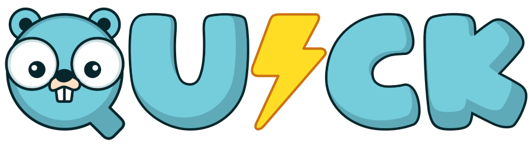

# 📚 Quick CLI Documentation

<p align="center">
  
</p>

<p align="center">
  <strong>Comprehensive documentation for the Quick CLI framework</strong>
</p>

## 📋 Table of Contents

- [Introduction](#introduction)
- [Getting Started](#getting-started)
  - [Installation](#installation)
  - [First Project](#first-project)
- [Commands Reference](#commands-reference)
  - [init](#init)
  - [addc](#addc)
  - [template](#template)
  - [ui](#ui)
- [Templates](#templates)
  - [Default Templates](#default-templates)
  - [Custom Templates](#custom-templates)
- [Project Structure](#project-structure)
- [Configuration](#configuration)
- [Advanced Usage](#advanced-usage)
- [Troubleshooting](#troubleshooting)
- [Contributing](#contributing)

## 🚀 Introduction

Quick CLI is a powerful command-line tool designed to help you create and manage projects using the Quick framework. With simple and intuitive commands, you can quickly scaffold new projects, add controllers, and manage templates.

The CLI is built with extensibility in mind, allowing you to create and use custom templates for your projects and components.

## 🏁 Getting Started

### Installation

#### Option 1 – Using go install

```bash
go install github.com/goquick-run/cli@latest
```

#### Option 2 – Clone and build manually

```bash
git clone https://github.com/goquick-run/cli.git
cd cli
go install
```

### First Project

Creating your first Quick project is as simple as running:

```bash
quick init my-first-project
```

This will create a new project with the default template. If you want to use a specific template, you can use the `--template` flag:

```bash
quick init my-api-project --template api
```

After creating your project, navigate to the project directory and run it:

```bash
cd my-first-project
go mod tidy
go run main.go
```

## 🛠️ Commands Reference

### init

The `init` command creates a new Quick project with the basic structure.

```bash
quick init [name-of-project] [flags]
```

**Flags:**
- `-t, --template string`: Template to use (default, api, web) (default "default")
- `-h, --help`: Help for init

**Examples:**

```bash
# Create a new project with the default template
quick init my-project

# Create a new project with the API template
quick init my-api --template api

# Create a new project in the current directory
quick init .
```

### addc

The `addc` command adds a new controller to an existing Quick project.

```bash
quick addc [controller-name] [flags]
```

**Flags:**
- `-h, --help`: Help for addc

**Examples:**

```bash
# Add a user controller
quick addc user

# Add a product controller
quick addc product
```

### template

The `template` command manages templates for the Quick CLI.

```bash
quick template [command]
```

**Subcommands:**
- `list`: List all available templates
- `add`: Add a new template
- `use`: Use a specific template

#### template list

```bash
quick template list
```

**Example output:**

```
Templates available:
----------------------
- default: Default template for Quick projects [web]
- api: Template for RESTful APIs [api]
- cli: Template for CLI applications [cli]
```

#### template add

```bash
quick template add [flags]
```

**Flags:**
- `--source string`: Template source (Git URL or local path)
- `--name string`: Template name
- `--description string`: Template description
- `--category string`: Template category (api, web, cli, custom) (default "custom")
- `-h, --help`: Help for add

**Examples:**

```bash
# Add a template from a Git repository
quick template add --source https://github.com/user/template.git --name my-template

# Add a template from a local directory
quick template add --source ./my-local-template --name my-template --description "My custom template" --category api
```

#### template use

```bash
quick template use [template-name] [flags]
```

**Flags:**
- `-h, --help`: Help for use

**Example:**

```bash
quick template use api-rest
```

### ui

The `ui` command launches an interactive UI to create a Quick project.

```bash
quick ui
```

## 🧩 Templates

Templates are the building blocks of Quick projects. They define the structure and functionality of your projects and components.

### Default Templates

Quick CLI comes with several built-in templates:

- **default**: A basic web application template
- **api**: A RESTful API template
- **cli**: A command-line application template

### Custom Templates

You can create and use your own templates. A template is a directory with a specific structure that Quick CLI can use to generate projects and components.

To create a custom template, you need to:

1. Create a directory with your template files
2. Add a `template.yaml` file with metadata about your template
3. Add your template to Quick CLI using the `template add` command

Example `template.yaml`:

```yaml
name: my-template
description: My custom template
category: api
version: 1.0.0
author: Your Name
```

## 📁 Project Structure

A typical Quick project has the following structure:

```
my-project/
├── cmd/
│   └── server/
│       └── main.go
├── internal/
│   ├── config/
│   │   └── config.go
│   ├── controllers/
│   │   └── home.go
│   ├── models/
│   │   └── user.go
│   └── routes/
│       └── routes.go
├── pkg/
│   └── utils/
│       └── utils.go
├── .gitignore
├── go.mod
├── go.sum
└── README.md
```

## ⚙️ Configuration

Quick CLI can be configured using a configuration file or environment variables.

### Configuration File

By default, Quick CLI looks for a configuration file at `$HOME/.quick.yaml`. You can specify a different file using the `--config` flag.

Example configuration file:

```yaml
templates:
  directory: ~/.quick/templates
  default: api
```

### Environment Variables

Quick CLI also supports configuration through environment variables. All environment variables should be prefixed with `QUICK_`.

Example:

```bash
export QUICK_TEMPLATES_DIRECTORY=~/.quick/templates
export QUICK_TEMPLATES_DEFAULT=api
```

## 🔍 Advanced Usage

### Creating Custom Templates

You can create custom templates for your projects and components. A template is a directory with a specific structure that Quick CLI can use to generate projects and components.

To create a custom template, you need to:

1. Create a directory with your template files
2. Add a `template.yaml` file with metadata about your template
3. Add your template to Quick CLI using the `template add` command

### Using Template Variables

Templates can use variables that will be replaced with actual values when the template is used. Variables are enclosed in double curly braces, like `{{.ProjectName}}`.

Available variables:

- `{{.ProjectName}}`: The name of the project
- `{{.PackageName}}`: The package name (usually the same as the project name)
- `{{.ControllerName}}`: The name of the controller (when using `addc`)

### Extending Quick CLI

Quick CLI is designed to be extensible. You can add new commands and functionality by forking the repository and adding your own code.

## ❓ Troubleshooting

### Common Issues

#### Template Not Found

If you get a "template not found" error, make sure the template exists in your templates directory. You can check the available templates using the `template list` command.

#### Permission Denied

If you get a "permission denied" error when creating a project, make sure you have write permissions in the target directory.

#### Go Module Issues

If you encounter issues with Go modules, try running `go mod tidy` in your project directory.

## 👥 Contributing

Contributions are welcome! Please feel free to submit a Pull Request.

1. Fork the repository
2. Create your feature branch (`git checkout -b feature/amazing-feature`)
3. Commit your changes (`git commit -m 'Add some amazing feature'`)
4. Push to the branch (`git push origin feature/amazing-feature`)
5. Open a Pull Request

---

<p align="center">
  Made with ❤️ by the Quick Team
</p>
